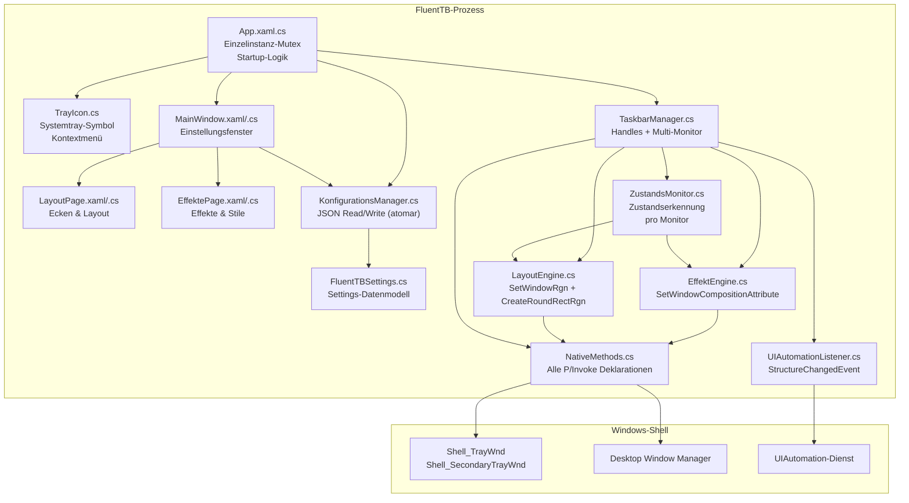
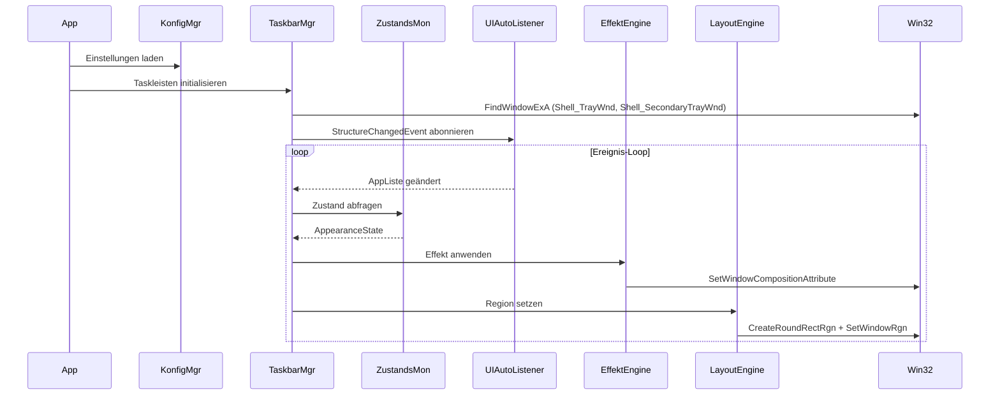
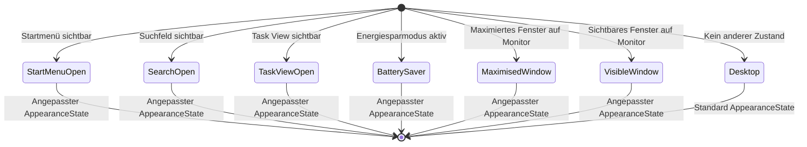

# Design-Dokument: FluentTB

## Überblick

FluentTB ist eine Windows-Desktopanwendung (C#, .NET 8.0-windows10.0.19041, WPF), die als Fork von
RoundedTB entsteht und die Taskleisten-Effekte von TranslucentTB nativ integriert – ohne externe C++-DLL,
ohne externes Prozess-Messaging. Die Anwendung läuft als schlanker Hintergrundprozess (Tray-Anwendung)
und kombiniert das Layout-System von RoundedTB (abgerundete Ecken, Margins, Dynamic/Split Mode) mit dem
Effekt-System von TranslucentTB (Clear, Blur, Acrylic, Mica, benutzerdefinierte Farben) in einem einzigen,
kohärenten Prozess.

### Kernziele

- **Kein Flackern**: Effekte werden direkt via P/Invoke gesetzt, ohne Nachrichten an externe Prozesse.
- **Ereignisgesteuert**: UIAutomation-Events statt Polling-Loop für Dynamic Mode und Zustandserkennung.
- **Plattformadaptiv**: Windows 11 (Build ≥ 22000) und Windows 10 (Build 17763–21999) werden vollständig unterstützt.
- **Robuste Konfiguration**: Atomares JSON-Schreiben, Rund-Trip-Serialisierung, Abwärtskompatibilität.

### Ziel-Framework und Abhängigkeiten

| Paket | Version | Zweck |
|---|---|---|
| .NET | 8.0-windows10.0.19041 | Laufzeit-Zielrahmen |
| WPF | integriert | UI-Framework |
| Wpf.Ui | 3.x | Fluent Design Controls (NavigationView, Cards) |
| System.Text.Json | integriert | JSON-Serialisierung |
| UIAutomationClient | integriert | UIAutomation-Events |
| Microsoft.Win32.Registry | integriert | Registry-Zugriff |
| FsCheck / CsCheck | aktuell | Property-Based Testing |


---

## Architektur

### Komponentendiagramm



### Laufzeit-Datenfluss




### OS-Kompatibilitätsmatrix

| Feature | Win10 (Build 17763–21999) | Win11 (Build ≥ 22000) |
|---|---|---|
| Clear / Blur / Acrylic / Farbe | ✅ | ✅ |
| Mica (`ACCENT_ENABLE_HOSTBACKDROP`) | ❌ → Fallback Acrylic | ✅ |
| Dynamic Mode | ❌ (deaktiviert) | ✅ |
| Split Mode | ✅ | ❌ (deaktiviert) |
| `DwmSetWindowAttribute` Corner Preference | ❌ | ✅ |
| Anti-Aliasing via DWM | ❌ | ✅ |
| Anti-Aliasing via WS_EX_LAYERED Alpha-Blending | ✅ | optional |
| `Shell_SecondaryTrayWnd` | ✅ | ✅ |
| UIAutomation Dynamic Mode | ❌ | ✅ |
| Polling-Fallback | ✅ (200 ms) | Nur bei UIAuto-Fehler |
| Minimale Build-Nummer | 17763 | 22000 |
| Start verweigern | Build < 17763 | – |

---

## Komponenten und Schnittstellen

### `NativeMethods.cs` – Konsolidierte P/Invoke Deklarationen

Alle Win32-Importe werden in einer einzigen, statischen Klasse `NativeMethods` im Namespace
`FluentTB.PInvoke` zusammengefasst. Kein `unsafe`-Code; alle Marshaling-Attribute werden explizit gesetzt.

```csharp
namespace FluentTB.PInvoke;

internal static class NativeMethods
{
    // ── Fenster-Komposition ──────────────────────────────────────────────────
    [DllImport("user32.dll", SetLastError = true)]
    internal static extern int SetWindowCompositionAttribute(
        IntPtr hwnd, ref WindowCompositionAttributeData data);

    // ── DWM ─────────────────────────────────────────────────────────────────
    [DllImport("dwmapi.dll", SetLastError = true)]
    internal static extern int DwmSetWindowAttribute(
        IntPtr hwnd, DwmWindowAttribute dwAttribute,
        ref int pvAttribute, int cbAttribute);

    [DllImport("dwmapi.dll")]
    internal static extern int DwmGetWindowAttribute(
        IntPtr hwnd, DwmWindowAttribute dwAttribute,
        out bool pvAttribute, int cbAttribute);

    // ── Region ──────────────────────────────────────────────────────────────
    [DllImport("gdi32.dll", SetLastError = true)]
    internal static extern IntPtr CreateRoundRectRgn(
        int x1, int y1, int x2, int y2, int w, int h);

    [DllImport("gdi32.dll", SetLastError = true)]
    internal static extern IntPtr CreateRectRgn(
        int x1, int y1, int x2, int y2);

    [DllImport("gdi32.dll")]
    internal static extern int CombineRgn(
        IntPtr hrgnDest, IntPtr hrgnSrc1, IntPtr hrgnSrc2, CombineRgnMode fnCombineMode);

    [DllImport("user32.dll", SetLastError = true)]
    internal static extern int SetWindowRgn(IntPtr hWnd, IntPtr hRgn, bool bRedraw);

    // ── Fenster-Eigenschaften ────────────────────────────────────────────────
    [DllImport("user32.dll", SetLastError = true)]
    internal static extern bool GetWindowRect(IntPtr hWnd, out RECT lpRect);

    [DllImport("user32.dll", SetLastError = true)]
    internal static extern int GetWindowLong(IntPtr hWnd, int nIndex);

    [DllImport("user32.dll", SetLastError = true)]
    internal static extern int SetWindowLong(IntPtr hWnd, int nIndex, int dwNewLong);

    [DllImport("user32.dll", SetLastError = true)]
    internal static extern bool SetLayeredWindowAttributes(
        IntPtr hwnd, uint crKey, byte bAlpha, LayeredWindowFlags dwFlags);

    [DllImport("user32.dll", SetLastError = true)]
    internal static extern bool GetLayeredWindowAttributes(
        IntPtr hwnd, out uint crKey, out byte bAlpha, out LayeredWindowFlags dwFlags);

    [DllImport("user32.dll")]
    internal static extern bool GetWindowPlacement(
        IntPtr hWnd, ref WINDOWPLACEMENT lpwndpl);

    [DllImport("user32.dll")]
    [return: MarshalAs(UnmanagedType.Bool)]
    internal static extern bool IsWindowVisible(IntPtr hWnd);

    [DllImport("user32.dll")]
    internal static extern bool IsIconic(IntPtr hWnd);

    // ── Fenster-Suche ────────────────────────────────────────────────────────
    [DllImport("user32.dll", SetLastError = true)]
    internal static extern IntPtr FindWindow(
        string? lpClassName, string? lpWindowName);

    [DllImport("user32.dll", SetLastError = true)]
    internal static extern IntPtr FindWindowEx(
        IntPtr hWndParent, IntPtr hWndChildAfter,
        string? lpszClass, string? lpszWindow);

    [DllImport("user32.dll", SetLastError = true)]
    internal static extern bool EnumWindows(EnumWindowsProc lpEnumFunc, IntPtr lParam);

    internal delegate bool EnumWindowsProc(IntPtr hwnd, IntPtr lParam);

    // ── Monitor / DPI ────────────────────────────────────────────────────────
    [DllImport("user32.dll")]
    internal static extern IntPtr MonitorFromWindow(IntPtr hwnd, MonitorFlag dwFlags);

    [DllImport("user32.dll")]
    internal static extern int GetDpiForWindow(IntPtr hwnd);

    // ── Maus ─────────────────────────────────────────────────────────────────
    [DllImport("user32.dll")]
    [return: MarshalAs(UnmanagedType.Bool)]
    internal static extern bool GetCursorPos(out POINT lpPoint);

    [DllImport("user32.dll")]
    internal static extern bool PtInRect(ref RECT lprc, POINT pt);

    // ── AppBar ───────────────────────────────────────────────────────────────
    [DllImport("shell32.dll", SetLastError = true)]
    internal static extern IntPtr SHAppBarMessage(AppBarMessage dwMessage, ref APPBARDATA pData);

    // ── Konstanten ───────────────────────────────────────────────────────────
    internal const int GWL_EXSTYLE        = -20;
    internal const int WS_EX_LAYERED      = 0x00080000;
    internal const int WS_EX_TRANSPARENT  = 0x00000020;
    internal const int DWMWA_WINDOW_CORNER_PREFERENCE = 33;
    internal const int DWMWCP_ROUND       = 2;
}
```


### `EffektEngine.cs`

**Verantwortlichkeit:** Setzt visuelle Effekte auf eine Taskleiste via `SetWindowCompositionAttribute`.
Kein externes Prozess-Messaging. Fehler werden protokolliert; bei Fehler wird der vorherige Effekt
beibehalten.

```csharp
namespace FluentTB.Core;

public sealed class EffektEngine
{
    /// <summary>
    /// Wendet den konfigurierten Effekt auf ein Taskleisten-Handle an.
    /// Gibt true zurück, wenn SetWindowCompositionAttribute erfolgreich war.
    /// </summary>
    public bool EffektAnwenden(IntPtr hwnd, AppearanceState erscheinung);

    /// <summary>
    /// Entfernt alle Effekte (setzt ACCENT_DISABLED).
    /// </summary>
    public void AlleEffekteEntfernen(IntPtr hwnd);

    /// <summary>
    /// Erstellt eine AccentPolicy aus einem AppearanceState.
    /// Reine Funktion – kein Seiteneffekt; testbar via PBT.
    /// </summary>
    internal static AccentPolicy AccentPolicyErzeugen(AppearanceState erscheinung, bool istWin11);

    /// <summary>
    /// Konvertiert einen RGBA-Color-Wert in das GradientColor-Format der AccentPolicy (ABGR).
    /// </summary>
    internal static int FarbeKonvertieren(RgbaFarbe farbe);
}
```

**Effekttyp → ACCENT_STATE Mapping:**

| `EffektTyp` | `AccentState` | AccentFlags | GradientColor |
|---|---|---|---|
| `Normal` | `ACCENT_DISABLED` (0) | 0 | 0 |
| `Transparent` | `ACCENT_ENABLE_TRANSPARENTGRADIENT` (2) | 2 | Alpha=0 |
| `Unschärfe` | `ACCENT_ENABLE_BLURBEHIND` (3) | 2 | konfiguriert |
| `Acrylic` | `ACCENT_ENABLE_ACRYLICBLURBEHIND` (4) | 2 | konfiguriert |
| `Mica` | `ACCENT_ENABLE_HOSTBACKDROP` (5) | 2 | – (Win11 only) |
| `OpakerFarbverlauf` | `ACCENT_ENABLE_GRADIENT` (1) | 2 | konfiguriert |
| `TransparenterFarbverlauf` | `ACCENT_ENABLE_TRANSPARENTGRADIENT` (2) | 2 | konfiguriert |

**GradientColor-Format:** Windows erwartet ABGR (nicht ARGB). Die Methode `FarbeKonvertieren` führt
die Byte-Umsortierung durch: `(A << 24) | (B << 16) | (G << 8) | R`.


### `LayoutEngine.cs`

**Verantwortlichkeit:** Berechnet und setzt `SetWindowRgn`-Regionen für alle Taskleisten-Segmente.
Berücksichtigt DPI-Skalierung, Dynamic Mode, Split Mode, Auto-Hide und Fill-on-Maximise.

```csharp
namespace FluentTB.Core;

public sealed class LayoutEngine
{
    /// <summary>
    /// Setzt die einfache abgerundete Region für eine Taskleiste (kein Dynamic/Split Mode).
    /// </summary>
    public bool EinfacheRegionSetzen(TaskbarInfo taskbar, SegmentSettings layout);

    /// <summary>
    /// Setzt die Dynamic-Mode-Region (Win11): AppListe + optional Tray + optional Widgets.
    /// Liest Ausrichtung aus der Registry (TaskbarAl) beim ersten Aufruf.
    /// </summary>
    public bool DynamicRegionSetzen(TaskbarInfo taskbar, FluentTBSettings einstellungen);

    /// <summary>
    /// Setzt zwei separate Regionen für Split Mode (Win10): AppListe und Tray.
    /// </summary>
    public bool SplitRegionSetzen(TaskbarInfo taskbar, FluentTBSettings einstellungen);

    /// <summary>
    /// Entfernt die Region (SetWindowRgn mit IntPtr.Zero) – für Fill-on-Maximise.
    /// </summary>
    public void RegionEntfernen(IntPtr hwnd);

    /// <summary>
    /// Berechnet eine EffektiveRegion aus SegmentSettings und DPI-Skalierung.
    /// Reine Funktion – keine Seiteneffekte; testbar via PBT.
    /// </summary>
    internal static EffektiveRegion RegionBerechnen(
        RECT taskbarRect, SegmentSettings layout, double skalierungsfaktor);

    /// <summary>
    /// Liest die Taskleisten-Ausrichtung aus der Registry.
    /// Gibt true für zentriert, false für links zurück.
    /// </summary>
    internal static bool AusrichtungAusRegistryLesen();

    /// <summary>
    /// Setzt Auto-Hide-Überblendung (Alpha-Werte animieren).
    /// </summary>
    public void AutoHideAnimieren(TaskbarInfo taskbar, bool einblenden);
}
```

**Region-Berechnung (DPI-aware):**

```
EffektiveRegion.Left   = MarginLeft  × ScaleFactor
EffektiveRegion.Top    = MarginTop   × ScaleFactor
EffektiveRegion.Width  = (TaskbarRect.Right - TaskbarRect.Left) - (MarginRight × ScaleFactor) + 1
EffektiveRegion.Height = (TaskbarRect.Bottom - TaskbarRect.Top) - (MarginBottom × ScaleFactor) + 1
EffektiveRegion.CornerRadius = CornerRadius × ScaleFactor
```

Wenn ein Margin-Wert negativ ist, wird die entsprechende Kante bis zum Bildschirmrand ausgedehnt
(Wert wird auf 0 geklemmt, bevor er in `CreateRoundRectRgn` übergeben wird).


### `ZustandsMonitor.cs`

**Verantwortlichkeit:** Ermittelt pro Monitor den aktiven Desktop-Zustand und liefert den zugehörigen
`AppearanceState` zurück. Kein Polling – die Erkennung wird von `TaskbarManager` bei eingehenden
UIAutomation-Events und dem infrequenten Timer (1000 ms) aufgerufen.

```csharp
namespace FluentTB.Core;

public sealed class ZustandsMonitor
{
    /// <summary>
    /// Ermittelt den höchstpriorisierten aktiven Zustand für den Monitor einer Taskleiste.
    /// Gibt immer genau einen (nicht-null) DesktopZustand zurück.
    /// </summary>
    public DesktopZustand AktivenZustandErmitteln(TaskbarInfo taskbar, FluentTBSettings einstellungen);

    /// <summary>
    /// Prüft, ob das Startmenü geöffnet ist.
    /// </summary>
    internal bool StartMenuGeöffnet();

    /// <summary>
    /// Prüft, ob das Suchfeld geöffnet ist.
    /// </summary>
    internal bool SuchfeldGeöffnet();

    /// <summary>
    /// Prüft, ob Task View geöffnet ist.
    /// </summary>
    internal bool TaskViewGeöffnet();

    /// <summary>
    /// Prüft, ob der Energiesparmodus aktiv ist.
    /// </summary>
    internal bool EnergiesparmodusAktiv();

    /// <summary>
    /// Prüft, ob ein Fenster auf dem Monitor der Taskleiste maximiert ist.
    /// </summary>
    internal bool MaximierteFensterVorhanden(IntPtr taskbarHwnd);

    /// <summary>
    /// Prüft, ob ein nicht-maximiertes, sichtbares Fenster auf dem Monitor vorhanden ist.
    /// </summary>
    internal bool SichtbareFensterVorhanden(IntPtr taskbarHwnd);
}
```

**Zustandspriorität (höchste zuerst):**



Wenn ein Zustand in den Einstellungen deaktiviert ist (`AppearanceState.Aktiviert = false`), wird er
übersprungen und der nächste Zustand in der Prioritätsliste wird geprüft. Der Zustand `Desktop` kann
nicht deaktiviert werden und ist immer der Fallback.


### `TaskbarManager.cs`

**Verantwortlichkeit:** Zentrale Koordinationsklasse. Verwaltet die Liste aller Taskleisten-Handles,
startet/stoppt den UIAutomation-Listener, koordiniert Effekt- und Layout-Engine und reagiert auf
Monitor-Änderungen.

```csharp
namespace FluentTB.Core;

public sealed class TaskbarManager : IDisposable
{
    /// <summary>
    /// Initialisiert alle Taskleisten beim Start.
    /// Liest Handles, DPI, Recovery-Region.
    /// </summary>
    public void Initialisieren(FluentTBSettings einstellungen);

    /// <summary>
    /// Ermittelt alle aktuell vorhandenen Taskleisten (primär + sekundär).
    /// </summary>
    public IReadOnlyList<TaskbarInfo> TaskleisteAbrufen();

    /// <summary>
    /// Wendet Effekte und Layout auf alle Taskleisten an.
    /// Wird bei Einstellungsänderung, UIAutomation-Event oder Timer aufgerufen.
    /// </summary>
    public void AlleAktualisieren(FluentTBSettings einstellungen);

    /// <summary>
    /// Prüft, ob sich die Anzahl der Taskleisten oder das primäre Handle geändert hat.
    /// Bei Änderung: Neu-Initialisierung.
    /// </summary>
    public bool TaskleisteGeändert();

    /// <summary>
    /// Setzt alle Taskleisten in den ursprünglichen Zustand zurück (beim Beenden).
    /// Ruft SetWindowRgn(hwnd, IntPtr.Zero, true) und AlleEffekteEntfernen auf.
    /// </summary>
    public void AlleZurücksetzen();

    /// <summary>
    /// Aktiviert oder deaktiviert alle Effekte temporär (Tray-Menü "Effekte deaktivieren").
    /// </summary>
    public void EffekteDeaktivieren(bool deaktivieren);
}
```

### `UIAutomationListener.cs`

**Verantwortlichkeit:** Abonniert `StructureChangedEvent` auf dem App-Listen-Fenster der Taskleiste.
Bei eingehendem Event wird `TaskbarManager.AlleAktualisieren` via `Dispatcher.InvokeAsync` auf dem
UI-Thread aufgerufen.

```csharp
namespace FluentTB.Core;

public sealed class UIAutomationListener : IDisposable
{
    /// <summary>
    /// Abonniert UIAutomation-Events für ein App-Listen-Handle.
    /// Gibt false zurück, wenn der Accessibility-Dienst nicht verfügbar ist.
    /// </summary>
    public bool Abonnieren(IntPtr appListHwnd, Func<Task> onÄnderung);

    /// <summary>
    /// Entfernt das Event-Abonnement.
    /// </summary>
    public void Abmelden();
}
```

Wenn `Abonnieren` fehlschlägt, wechselt `TaskbarManager` automatisch auf einen Polling-Timer
mit 200 ms Intervall und schreibt eine Warnung ins Log.


### `KonfigurationsManager.cs`

**Verantwortlichkeit:** Liest und schreibt `FluentTBSettings` als JSON. Atomares Schreiben via
temporäre Datei + Umbenennen. Verwendet `System.Text.Json` mit `JsonIgnoreCondition.Never` und
einem benutzerdefinierten `RgbaFarbeConverter`.

```csharp
namespace FluentTB.Config;

public sealed class KonfigurationsManager
{
    private static readonly string KonfigPfad =
        Path.Combine(Environment.GetFolderPath(Environment.SpecialFolder.ApplicationData),
                     "FluentTB", "config.json");

    /// <summary>
    /// Lädt Einstellungen aus der Konfigurationsdatei.
    /// Bei fehlender oder korrupter Datei: Standardwerte.
    /// </summary>
    public FluentTBSettings Laden();

    /// <summary>
    /// Speichert Einstellungen atomar in die Konfigurationsdatei.
    /// Wenn DisableSaving = true: kein Schreibvorgang.
    /// </summary>
    public void Speichern(FluentTBSettings einstellungen);

    /// <summary>
    /// Serialisiert ein FluentTBSettings-Objekt zu JSON.
    /// </summary>
    internal static string Serialisieren(FluentTBSettings einstellungen);

    /// <summary>
    /// Deserialisiert JSON zu einem FluentTBSettings-Objekt.
    /// Unbekannte Schlüssel werden ignoriert.
    /// </summary>
    internal static FluentTBSettings Deserialisieren(string json);
}
```

**Atomares Schreiben:**
1. JSON in `config.json.tmp` schreiben.
2. `File.Move(tmp, config.json, overwrite: true)` – atomar auf NTFS.
3. Bei Exception: `config.json.tmp` löschen, Fehler protokollieren.


### UI-Komponenten

#### `MainWindow.xaml/.cs`

Einstellungsfenster mit `NavigationView` (Wpf.Ui). Schließen minimiert das Fenster in den Hintergrund
(`Window.Closing` wird abgefangen: `e.Cancel = true; Hide()`). Zwei Navigations-Seiten:

- **LayoutPage** – Ecken & Layout
- **EffektePage** – Effekte & Stile

#### `LayoutPage.xaml/.cs`

| Steuerelement | Bindung | Bereich |
|---|---|---|
| Slider / NumberBox CornerRadius | `SegmentSettings.CornerRadius` | 0–50 px |
| NumberBox MarginTop/Bottom/Left/Right | `SegmentSettings.MarginXxx` | −20 bis +50 px |
| ToggleSwitch Dynamic Mode | `FluentTBSettings.DynamicMode` | Win11 only |
| ToggleSwitch Split Mode | `FluentTBSettings.SplitMode` | Win10 only |
| ToggleSwitch Fill on Maximise | `FluentTBSettings.FülleBeiMaximierung` | alle |
| ToggleSwitch Auto-Hide | `FluentTBSettings.AutoHide` | alle |

#### `EffektePage.xaml/.cs`

Für jeden der sieben Zustände (`Desktop`, `SichtbaresFenster`, `MaximiertessFenster`,
`StartmenüGeöffnet`, `SuchfeldGeöffnet`, `TaskViewGeöffnet`, `Energiesparmodus`) wird
eine `CardExpander`-Zeile dargestellt mit:

- `ComboBox` Effekttyp (`Normal`, `Transparent`, `Unschärfe`, `Acrylic`, `Mica`, `Opake Farbe`, `Transparente Farbe`)
- `ColorPicker` (Wpf.Ui) für RGBA – nur sichtbar bei Farb-Effekttypen
- `NumberBox` Blur-Radius (0–750)
- `CheckBox` ShowPeek, ShowLine
- Tooltip „Mica erfordert Windows 11 (Build ≥ 22000)" bei Mica-Auswahl auf Win10

#### `TrayIcon.cs`

Verwendet `WPF NotifyIcon` (Hardcodet) oder `Wpf.Ui TrayIcon`. Kontextmenü-Einträge:
- **Einstellungen öffnen** → `MainWindow.Show(); mainWindow.Activate();`
- **Effekte deaktivieren** (Toggle) → `taskbarManager.EffekteDeaktivieren(bool)`
- **Beenden** → `taskbarManager.AlleZurücksetzen(); Application.Current.Shutdown();`

---

## Datenmodelle

### Enumerationen

```csharp
namespace FluentTB.Core;

/// <summary>
/// Windows-Kompositionsattribut-Zustand für SetWindowCompositionAttribute.
/// Werte direkt aus user32.hpp (undokumentiert).
/// </summary>
public enum AccentState : int
{
    ACCENT_DISABLED                 = 0,
    ACCENT_ENABLE_GRADIENT          = 1,
    ACCENT_ENABLE_TRANSPARENTGRADIENT = 2,
    ACCENT_ENABLE_BLURBEHIND        = 3,
    ACCENT_ENABLE_ACRYLICBLURBEHIND = 4,
    ACCENT_ENABLE_HOSTBACKDROP      = 5,  // Mica – nur Win11
    ACCENT_INVALID_STATE            = 6,
}

/// <summary>
/// Benutzerfreundlicher Effekttyp (UI-Auswahl → AccentState Mapping).
/// </summary>
public enum EffektTyp
{
    Normal = 0,
    Transparent = 1,
    Unschärfe = 2,
    Acrylic = 3,
    Mica = 4,
    OpakerFarbverlauf = 5,
    TransparenterFarbverlauf = 6,
}

/// <summary>
/// Desktop-Zustände, nach Priorität geordnet (höchster Index = höchste Priorität).
/// </summary>
public enum DesktopZustand
{
    Desktop = 0,
    SichtbaresFenster = 1,
    MaximiertessFenster = 2,
    Energiesparmodus = 3,
    TaskViewGeöffnet = 4,
    SuchfeldGeöffnet = 5,
    StartmenüGeöffnet = 6,
}

public enum WindowsVersion { Unsupported, Windows10, Windows11 }
```

